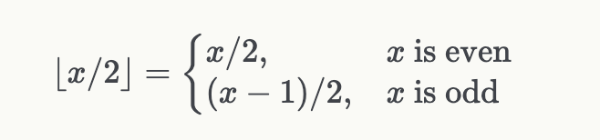

# 非确定性跳转
我们现在可以描述一种代码模式，称为“非确定性跳转”，它结合了条件跳转和提示。 非确定性跳转是根据证明者的决定（而不是根据之前计算的值的条件）可能会或可能不会执行的跳转指令。 为此，请使用 Cairo 指令：

```
jmp label if [ap] != 0, ap++;
```

这个想法是使用一个未使用的存储单元（`[ap]`）来决定是否跳转。 不要忘记增加 ap 以确保以下指令不会使用此存储单元。

与每条非确定性指令一样，必须附加一个提示，让证明者知道是否跳转。 例如：

```
%{ memory[ap] = 1 if x > 10 else 0 %}
jmp label if [ap] != 0, ap++;
```

练习

下列的代码尝试计算表达式 $[x/2]$ 使用公式：




（回想一下，因为我们在一个字段中工作，所以运算 / 2 在字段中是除以 2，而不是整数除法）。

你能解释一下下面的代码有什么问题吗？

```
func div2(x) {
    %{ memory[ap] = ids.x % 2 %}
    jmp odd if [ap] != 0, ap++;

    even:
    // Case x % 2 == 0.
    [ap] = x / 2, ap++;
    ret;

    odd:
    // Case x % 2 == 1.
    [ap] = x - 1, ap++;
    [ap] = [ap - 1] / 2, ap++;
    ret;
}
```

在整数除法中，您将看到如何使用内置范围检查来实现此功能。